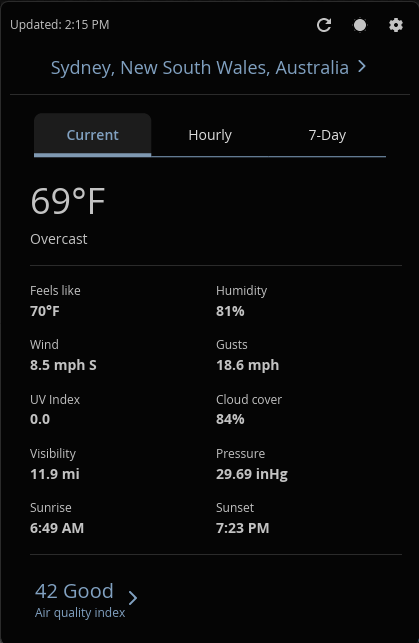
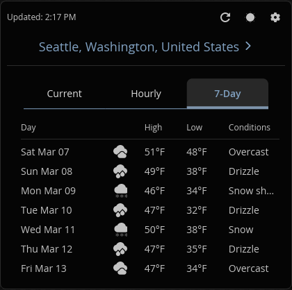
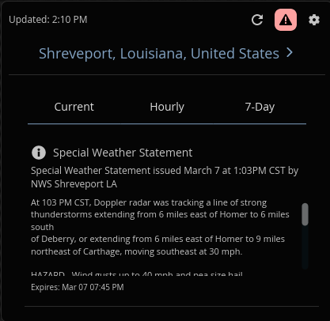
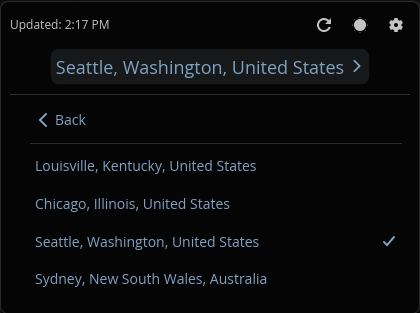

<div align="center">

# Tempest

**A weather applet for [COSMIC Desktop](https://system76.com/cosmic) that just works.**

Real-time weather, air quality, alerts, and forecasts right in your panel.
No API keys. No accounts. Just weather.

[](./LICENSE)
[](https://hosted.weblate.org/engage/tempest/)

<br>



</div>

---

<details>
<summary><strong>More screenshots</strong></summary>
<br>

| 7-Day Forecast | Weather Alerts |
|----------------|----------------|
|  |  |

| Saved Locations |
|-----------------|
|  |

</details>

## What you get

- **Panel display** with temperature, weather icon, AQI, pressure, dew point, and sunrise/sunset (all toggleable)
- **Tabbed popup** with current conditions, hourly forecast, 7-day outlook, weather alerts, and settings
- **Air quality monitoring** with PM2.5, PM10, Ozone, NO2, CO, and automatic US/EU AQI standard detection
- **Weather alerts** from NWS (US), ECCC (Canada), MeteoAlarm (EU), and BOM (Australia) with desktop notifications
- **Saved locations** so you can bookmark cities and switch between them with one tap
- **Automatic location** via IP geolocation, or search by city name, or enter coordinates manually
- **Smart connectivity** that retries on failure and refreshes instantly when your network comes back
- **10 languages** and counting, powered by community translators on Weblate
- **Zero configuration required** out of the box, fully customizable if you want it

All weather data comes from [Open-Meteo](https://open-meteo.com/). No API key needed, no rate limits to worry about.

## Install

**COSMIC Store** - Search for "Tempest" under Applets. One click, done.

**From source:**

```bash
git clone https://gitlab.com/vintagetechie/cosmic-ext-applet-tempest
cd cosmic-ext-applet-tempest
just build-release
sudo just install
```

Also available as `.deb` and `.rpm`:

```bash
just build-deb && sudo just install-deb    # Debian/Ubuntu
just build-rpm && sudo just install-rpm    # Fedora/openSUSE
```

For vendored builds: `just vendor && just vendor-build`

## Configuration

Click the applet, hit the Settings tab. Everything's there: location mode, units (temperature, pressure, measurement system), refresh interval, alert toggles, panel display options. Settings persist automatically.

Defaults to auto-detecting your location. Falls back to New York if detection fails. Respects your system's 12/24 hour time preference.

## Translations

[](https://hosted.weblate.org/engage/tempest/)

Tempest is translated into Czech, German, Hungarian, Polish, Portuguese (Brazil), Russian, Simplified Chinese, Swedish, and Ukrainian, with more on the way.

Want to help? Head to [Tempest on Weblate](https://hosted.weblate.org/engage/tempest/) and start translating. No coding required.

**Translation contributors:** lorduskordus (Czech), therealmate (Hungarian), VandaL (Polish), Marco Agostini (Portuguese/Brazil), FaNToMaSikkk (Russian), Geeson Wan (Simplified Chinese), bittin (Swedish), Димко (Ukrainian)

## Development

```bash
just build-debug    # debug build
just check          # clippy
just check-json     # LSP-compatible output
```

## Changelog

### 2.5.0

You can now bookmark locations and switch between them without re-searching every time. Tap the location name in the popup header to see your saved spots and switch with one click. The settings tab has a bookmark button on search results and a section for managing saved locations. Capped at 8 because nobody needs more than that. Also did a cleanup pass: streamlined the panel rendering, swapped manual loops for iterators in the weather parser, and pruned 17 dead i18n strings.

### 2.4.3

The applet would just give up if the network wasn't ready at boot. VPN still connecting? Enjoy staring at "ERR" for 15 minutes. Now it retries failed fetches with exponential backoff (5s, 15s, 30s, 60s) and listens to NetworkManager over D-Bus for instant refresh when connectivity comes back. HTTP requests also have a 15-second timeout so dead connections don't hang forever. Falls back gracefully if NM isn't available.

### 2.4.2

Migrated the project from Codeberg to GitLab. Set up a CI/CD pipeline that builds .deb packages automatically on release tags, and a lightweight merge request pipeline for merge gating.

### 2.4.1

Added missing weather codes for freezing drizzle and freezing rain conditions. Picked up a batch of translation updates from Weblate covering Czech, Chinese (Simplified), German, Hungarian, Polish, Portuguese (Brazil), Swedish, Ukrainian, and English (US).

### 2.4.0

Added pressure unit selection with hPa, inHg, and PSI options in the settings panel. Auto-units now picks inHg for imperial countries. Fixed long condition text like "Thunderstorm with hail" overflowing the 7-day forecast widget border by using the new libcosmic ellipsis support. Routed the remaining hardcoded UI strings through Fluent so translators can pick them up. Added Ukrainian metainfo and desktop translations.

### 2.3.3

Added Portuguese (Brazil) translation and Czech appstream metainfo localization. Picked up the latest Weblate batch which added the weather-fetch-error string across Czech, Hungarian, Polish, Swedish, and Chinese, and refined some existing Czech and Hungarian wording.

For older releases, see [CHANGELOG.md](./CHANGELOG.md).

## License

GPL-3.0-only - See [LICENSE](./LICENSE)

## Author

John Crenshaw - [blog.vintagetechie.com](https://blog.vintagetechie.com)
