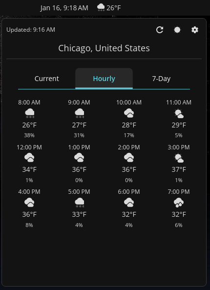
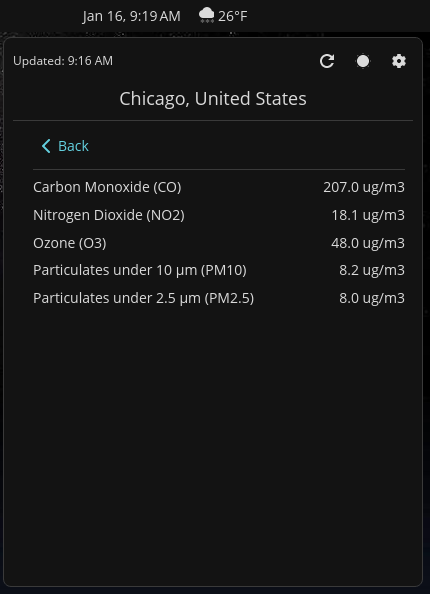
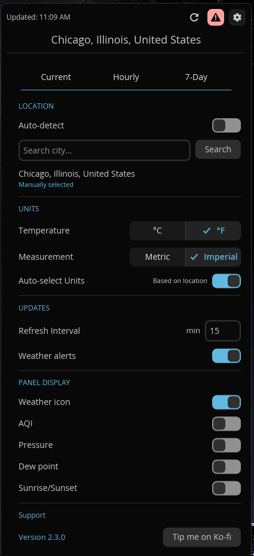

# Tempest

A weather applet for COSMIC Desktop with automatic location detection.

## Screenshots

| Main | Hourly | 7-Day |
|------|--------|-------|
|  |  |  |

| Air Quality | Alerts | Settings |
|-------------|--------|----------|
|  |  |  |

## Features

- Real-time weather data from Open-Meteo API (no API key required)
- Customizable panel display (temperature, weather icon, AQI, pressure, dew point, sunrise/sunset)
- Detailed popup with tabbed interface:
  - **Current**: Temperature, feels-like, humidity, wind, UV index, cloud cover, visibility, pressure, sunrise/sunset, and air quality (AQI with pollutants subview)
  - **Hourly**: Next 12 hours forecast with precipitation probability
  - **7-Day**: Weekly forecast with high/low temperatures and conditions
  - **Alerts**: Weather alerts from NWS (US), ECCC (Canada), MeteoAlarm (EU), BOM (Australia)
  - **Settings**: All configuration options
- Air quality data with US/EU AQI standards, PM2.5, PM10, Ozone, NO2, CO levels
- Automatic location detection via IP geolocation
- Manual location override with city search
- Respects system 12/24 hour time format
- Configurable temperature unit (Fahrenheit/Celsius)
- Configurable measurement system (Imperial/Metric) for wind and visibility
- Configurable refresh interval
- Desktop notifications for weather alerts
- Persistent configuration
- Global weather coverage

## Installation

Clone the repository:

```bash
git clone https://codeberg.org/VintageTechie/cosmic-ext-applet-tempest
cd cosmic-ext-applet-tempest
```

Build and install the project:

```bash
just build-release
sudo just install
```

For alternative packaging methods:

- `deb`: run `just build-deb` and `sudo just install-deb`
- `rpm`: run `just build-rpm` and `sudo just install-rpm`

For vendoring, use `just vendor` and `just vendor-build`

## Configuration

Click the applet to open the popup and navigate to the Settings tab where you can:

- Toggle between automatic and manual location detection
- Search for a city by name or enter coordinates manually
- Toggle temperature unit (Fahrenheit/Celsius)
- Toggle measurement system (Imperial/Metric)
- Set refresh interval (1-1440 minutes)
- Enable or disable weather alerts
- Customize panel display (icon, AQI, pressure, dew point, sunrise/sunset)

Settings are automatically saved and persist across sessions. The applet defaults to automatic location detection; New York City is used as a fallback if detection fails.

## Translations

Tempest uses [Weblate](https://hosted.weblate.org/projects/tempest/) for translations. Contributions are welcome!

[](https://hosted.weblate.org/engage/tempest/)

To contribute translations:
1. Visit [Tempest on Weblate](https://hosted.weblate.org/projects/tempest/tempest/)
2. Select your language or start a new one
3. Translate strings through the web interface

No coding experience required - just knowledge of your language!

### Translation Contributors

Thanks to everyone who helped translate Tempest:

| Language | Contributor |
|----------|-------------|
| Czech | lorduskordus |
| Hungarian | therealmate |
| Polish | VandaL |
| Portuguese (Brazil) | Marco Agostini |
| Russian | FaNToMaSikkk |
| Simplified Chinese | Geeson Wan |
| Swedish | bittin |

## Development

A [justfile](./justfile) is included with common recipes:

- `just build-debug` - Compile with debug profile
- `just check` - Run clippy linter
- `just check-json` - LSP-compatible linter output

## Changelog

### 2.3.2

Sanitized error messages shown in the popup to hide raw API URLs that could leak coordinates in screenshots. Alert notifications from external APIs now get HTML tags stripped and length capped before hitting the notification daemon. Widened the popup to 520px and rebalanced the forecast table columns so dates don't wrap.

### 2.3.1

Added Polish translation. Improved max popup height calculation. Updated dependencies.

### 2.3.0

Added Hungarian and Russian translations. Improved popup max height calculation for better fit on various screen sizes. Minor spacing improvements in panel display. Cleaned up deprecated translation keys.

### 2.2.1

Restored version display and Ko-fi tip button to the settings tab. These got lost during the 2.0.0 settings redesign.

### 2.2.0

Popup height now adapts to screen resolution. Uses cosmic-randr to query display size at startup and sets max popup height accordingly. Popup shrinks to fit content instead of always filling to max, so smaller tabs no longer have unnecessary empty space.

### 2.1.0

Switched to tab bar navigation for a cleaner look. Air quality info now lives in the Current tab with a dedicated pollutants subview. Times throughout the app now respect the system 12/24 hour preference. Polished spacing and alignment across all tabs. Added Czech translation.

### 2.0.0

Redesigned settings interface with improved COSMIC integration. The tab bar now uses the standard segmented control with recessed styling to match other COSMIC applets. Settings got a complete overhaul with section headers, segmented controls for temperature and measurement units, and a cleaner layout that adapts based on whether auto-detect is enabled. Auto-select units now applies immediately when toggled. Pinned libcosmic to a stable commit after an upstream regression broke builds.

### 1.8.1

Internal code quality improvements and translation updates. Added Simplified Chinese translation, updated German and French via Weblate. Migrated error handling to anyhow for better error context. Removed dead code and unused struct fields across weather and config modules. Fixed a potential panic in HTTP client initialization.

## License

GPL-3.0-only - See [LICENSE](./LICENSE)

## Author

John Crenshaw — [blog.vintagetechie.com](https://blog.vintagetechie.com)
